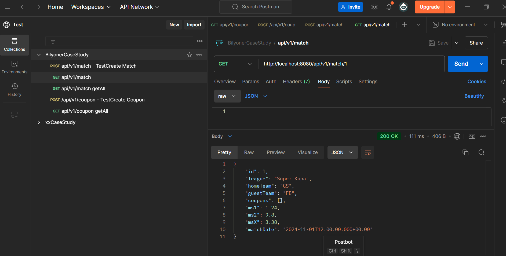

# Case Study - Rest API/ WebSocket - Bilyoner

Bu döküman, Bilyoner Case Study için API dokümantasyonunu ve örnek ekran görüntülerini içerir.
Geliştirilen/kullanılan teknolojiler ve özellikler başlıca aşağıdaki gibidir:

- Spring Boot, Hibernate,JPA,Swagger,H2 ve SonarLint kullanılmıştır.
- ControllerAdvice, ExceptionHandler,ModelMapper, Validation kullanılmıştır.
- WebSocket, STOMP, Jquery, Bootstrap kullanılmıştır.
- Sistem başladığında H2 veritabanı otomatik olarak oluşturulur.
- POST api/v1/match endpointi ile maç bilgileri oluşturulur. 
- Maç bilgileri için bahis oranları Scheduler ile her saniyede yeniden hesaplanır ve Socket ile frontend e gönderilir.
- En sonda API test ekran görüntüleri eklenmiştir. Postman ile test edilmesi için ilgili buton veya link eklenmiştir.

## Database Panel Bilgileri
http://localhost:8080/h2-console/login.jsp?jsessionid=62b1dfa0b128216458074185ccf56318

username: sa

password: password

## Web Arayüzü
http://localhost:8080/bahis.html


## Kurulum

Use the package manager [maven](https://maven.apache.org/) to install TikTak Expertise Case Study.
- Java Version: 21
- Spring Boot Version :3.3.4

Timeout ayarları için application.properties dosyasına aşağıdaki satırı düzenleyebilirsiniz.


```bash
mvn clean install
mvn spring-boot:run
```

## Usage

Apiye ulaşmak için online collectionları kullanabilirsiniz

Download Desktop Agent ile hazır olan api'ler tarayıcı ile test edilebilir.

Postman ile bu collectionu direk import edebilirsiniz.
[](https://app.getpostman.com/run-collection/8785996-cd6bece6-c1b9-4f53-a02d-ab704f311b27?action=collection%2Ffork&source=rip_markdown&collection-url=entityId%3D8785996-cd6bece6-c1b9-4f53-a02d-ab704f311b27%26entityType%3Dcollection%26workspaceId%3D623a4504-47d5-4070-ab4f-841c1d31010f)


## Api Dokümantasyonu - Swagger UI

Swagger UI ile api dokümantasyonu oluşturulmuştur.

http://localhost:8080/swagger-ui.html


## API Örnek Ekran Görüntüleri

### Create Match Example


### get match Example

### get match all example

### Case create coupon

### Case 5

